# Modelo de Banco de Dados

## 1. Visão Geral

- **Paradigma:** Relacional (ex.: PostgreSQL, MySQL, SQL Server – agnóstico).
- **Escopo:** Entidades necessárias para suportar as funcionalidades descritas em:
  - Conta & Autenticação
  - Círculos & Membros
  - Localização em tempo real & Histórico
  - Lugares & Geofences
  - Direção & Segurança
  - SOS & Incidentes
  - Chat & Check-ins
  - Notificações
  - Planos & Assinaturas
  - Administração

Convenções:

- Chaves primárias: `id` (UUID ou BIGINT auto-increment conforme tecnologia).
- Datas: `created_at`, `updated_at` (timestamp com fuso).
- Booleans: `is_*` / `has_*`.

---

## 2. Domínio de Contas, Autenticação e Dispositivos

### 2.1. Tabela `users`

Representa o usuário final do sistema.

- `id` (PK)
- `email` (unique, nullable se usar só telefone)
- `phone_number` (unique, nullable)
- `full_name`
- `first_name`
- `last_name`
- `birth_date` (nullable)
- `gender` (nullable, código/enum)
- `profile_photo_url` (nullable)
- `preferred_language` (ex.: `pt-BR`, `en-US`)
- `timezone` (ex.: `America/Sao_Paulo`)
- `distance_unit` (ENUM: `KM`, `MILES`)
- `status` (ENUM: `ACTIVE`, `BLOCKED`, `PENDING_VERIFICATION`)
- `created_at`
- `updated_at`

Índices sugeridos:

- `idx_users_email`
- `idx_users_phone_number`

### 2.2. Tabela `auth_identities`

Gerencia múltiplas formas de autenticação por usuário.

- `id` (PK)
- `user_id` (FK → `users.id`)
- `provider` (ENUM: `PASSWORD`, `GOOGLE`, `APPLE`, `FACEBOOK`, `PHONE_SMS`)
- `provider_user_id` (ID externo, se aplicável)
- `email` (cópia opcional)
- `phone_number` (cópia opcional)
- `password_hash` (apenas para `PASSWORD`, nullable nos demais)
- `is_verified` (bool)
- `last_login_at` (nullable)
- `created_at`
- `updated_at`

Índices:

- `idx_auth_identities_user_id`
- `idx_auth_identities_provider_user` (provider, provider_user_id)

### 2.3. Tabela `verification_tokens`

Tokens de verificação (e-mail/telefone) e recuperação de senha.

- `id` (PK)
- `user_id` (FK → `users.id`)
- `type` (ENUM: `EMAIL_VERIFICATION`, `PHONE_VERIFICATION`, `PASSWORD_RESET`)
- `token` (string única)
- `expires_at`
- `used_at` (nullable)
- `created_at`

Índices:

- `idx_verification_tokens_token`
- `idx_verification_tokens_user_type`

### 2.4. Tabela `devices`

Rastreia dispositivos para push notification e informações técnicas.

- `id` (PK)
- `user_id` (FK → `users.id`)
- `platform` (ENUM: `ANDROID`, `IOS`, `WEB`)
- `device_model` (nullable)
- `os_version` (nullable)
- `app_version` (nullable)
- `push_token` (nullable)
- `is_active` (bool)
- `last_seen_at` (nullable)
- `created_at`
- `updated_at`

Índices:

- `idx_devices_user_id`
- `idx_devices_push_token`

---

## 3. Domínio de Círculos e Membros

### 3.1. Tabela `circles`

Grupos (família, amigos, etc.).

- `id` (PK)
- `name`
- `description` (nullable)
- `photo_url` (nullable)
- `color_hex` (nullable, ex.: `#FF6600`)
- `privacy_level` (ENUM: `OPEN_WITH_CODE`, `INVITE_ONLY`)
- `created_by_user_id` (FK → `users.id`)
- `created_at`
- `updated_at`

Índices:

- `idx_circles_created_by`

### 3.2. Tabela `circle_members`

Associação usuários ↔ círculos, com papéis.

- `id` (PK)
- `circle_id` (FK → `circles.id`)
- `user_id` (FK → `users.id`)
- `role` (ENUM: `ADMIN`, `MEMBER`)
- `status` (ENUM: `ACTIVE`, `PENDING`, `REMOVED`)
- `joined_at` (nullable)
- `left_at` (nullable)
- `created_at`
- `updated_at`

Restrições:

- `UNIQUE (circle_id, user_id)`

Índices:

- `idx_circle_members_circle_id`
- `idx_circle_members_user_id`

### 3.3. Tabela `circle_invites`

Convites diretos e via código/link.

- `id` (PK)
- `circle_id` (FK → `circles.id`)
- `invited_by_user_id` (FK → `users.id`)
- `target_email` (nullable)
- `target_phone` (nullable)
- `invite_code` (string única, para uso manual/link)
- `status` (ENUM: `PENDING`, `ACCEPTED`, `EXPIRED`, `CANCELLED`)
- `accepted_by_user_id` (FK → `users.id`, nullable)
- `expires_at` (nullable)
- `created_at`
- `updated_at`

Índices:

- `idx_circle_invites_circle_id`
- `idx_circle_invites_invite_code`

### 3.4. Tabela `circle_settings`

Configurações específicas por círculo.

- `id` (PK)
- `circle_id` (FK → `circles.id`, unique)
- `driving_alert_level` (ENUM: `LOW`, `MEDIUM`, `HIGH`)
- `allow_member_chat` (bool)
- `allow_member_sos` (bool)
- `created_at`
- `updated_at`

---

## 4. Domínio de Localização em Tempo Real & Histórico

### 4.1. Tabela `locations`

Eventos de localização brutos/históricos.

- `id` (PK)
- `user_id` (FK → `users.id`)
- `circle_id` (FK → `circles.id`, nullable – para otimizar consultas por círculo)
- `latitude` (decimal)
- `longitude` (decimal)
- `accuracy_meters` (nullable)
- `speed_mps` (nullable)
- `heading_degrees` (nullable)
- `altitude_meters` (nullable)
- `source` (ENUM: `GPS`, `NETWORK`, `FUSED`)
- `recorded_at` (timestamp da captura no dispositivo)
- `received_at` (timestamp da chegada no backend)
- `is_moving` (bool, derivado)
- `battery_level` (nullable, 0–100)
- `created_at`

Índices:

- `idx_locations_user_time` (user_id, recorded_at DESC)
- `idx_locations_circle_time` (circle_id, recorded_at DESC)
- Índice geoespacial (dependente do SGBD) para consultas por área.

### 4.2. Tabela `location_sharing_states`

Estado agregado de compartilhamento por usuário e círculo.

- `id` (PK)
- `user_id` (FK → `users.id`)
- `circle_id` (FK → `circles.id`)
- `is_sharing_location` (bool)
- `is_history_enabled` (bool)
- `paused_until` (nullable)
- `last_known_location_id` (FK → `locations.id`, nullable)
- `last_updated_at`

Restrições:

- `UNIQUE (user_id, circle_id)`

Índices:

- `idx_location_sharing_user_circle`

---

## 5. Domínio de Lugares (Places) & Geofences

### 5.1. Tabela `places`

Locais de interesse configurados por círculo.

- `id` (PK)
- `circle_id` (FK → `circles.id`)
- `name`
- `type` (ENUM: `HOME`, `SCHOOL`, `WORK`, `OTHER`)
- `address_text` (nullable)
- `latitude`
- `longitude`
- `radius_meters`
- `is_active` (bool)
- `created_by_user_id` (FK → `users.id`)
- `created_at`
- `updated_at`

Índices:

- `idx_places_circle_id`

### 5.2. Tabela `place_alert_policies`

Configurações de quem recebe alertas e quando.

- `id` (PK)
- `place_id` (FK → `places.id`)
- `circle_id` (FK → `circles.id` – redundante para facilitar filtros)
- `alert_on_enter` (bool)
- `alert_on_exit` (bool)
- `days_of_week` (nullable, ex.: máscara binária ou lista `MON,TUE,...`)
- `start_time` (nullable, ex.: `08:00`)
- `end_time` (nullable, ex.: `18:00`)
- `target_type` (ENUM: `ALL_MEMBERS`, `ADMINS_ONLY`, `CUSTOM_LIST`)
- `created_at`
- `updated_at`

### 5.3. Tabela `place_alert_targets`

Lista de membros específicos que recebem alertas daquele lugar (quando `CUSTOM_LIST`).

- `id` (PK)
- `policy_id` (FK → `place_alert_policies.id`)
- `user_id` (FK → `users.id`)

Restrições:

- `UNIQUE (policy_id, user_id)`

### 5.4. Tabela `place_events`

Eventos gerados quando membros entram/saem de geofences.

- `id` (PK)
- `place_id` (FK → `places.id`)
- `circle_id` (FK → `circles.id`)
- `user_id` (FK → `users.id`)
- `event_type` (ENUM: `ENTER`, `EXIT`)
- `location_id` (FK → `locations.id`, nullable)
- `occurred_at`
- `created_at`

Índices:

- `idx_place_events_place_time`
- `idx_place_events_user_time`

---

## 6. Domínio de Direção & Segurança no Trânsito

### 6.1. Tabela `drives`

Segmentos de deslocamento veicular detectados automaticamente.

- `id` (PK)
- `user_id` (FK → `users.id`)
- `circle_id` (FK → `circles.id`, nullable)
- `mode` (ENUM: `CAR`)
- `start_location_id` (FK → `locations.id`)
- `end_location_id` (FK → `locations.id`)
- `start_time`
- `end_time`
- `distance_meters`
- `duration_seconds`
- `max_speed_mps`
- `avg_speed_mps`
- `safety_score` (0–100, aplicável principalmente a `mode = CAR`)
- `created_at`
- `updated_at`

Índices:

- `idx_drives_user_time` (user_id, start_time DESC)

### 6.2. Tabela `drive_events`

Eventos de comportamento de direção dentro de uma viagem (tipicamente para `mode = CAR`).

- `id` (PK)
- `drive_id` (FK → `drives.id`)
- `user_id` (FK → `users.id`)
- `event_type` (ENUM: `SPEEDING`, `HARD_BRAKE`, `HARD_ACCEL`, `HARD_TURN`, `PHONE_USAGE`)
- `severity` (ENUM: `LOW`, `MEDIUM`, `HIGH`)
- `location_id` (FK → `locations.id`, nullable)
- `speed_mps` (nullable)
- `occurred_at`
- `created_at`

Índices:

- `idx_drive_events_drive_id`
- `idx_drive_events_user_time`

---

## 7. Domínio de SOS & Incidentes

### 7.1. Tabela `sos_events`

Registra acionamentos de SOS (manuais ou automáticos).

- `id` (PK)
- `user_id` (FK → `users.id`)
- `circle_id` (FK → `circles.id`)
- `trigger_type` (ENUM: `MANUAL`, `AUTO_COLLISION_DETECTED`)
- `location_id` (FK → `locations.id`, nullable)
- `message` (nullable, ex.: texto opcional do usuário)
- `status` (ENUM: `OPEN`, `RESOLVED`, `CANCELLED`)
- `started_at`
- `resolved_at` (nullable)
- `cancelled_at` (nullable)
- `created_at`
- `updated_at`

Índices:

- `idx_sos_events_circle_time`
- `idx_sos_events_user_time`

### 7.2. Tabela `incident_detections`

Eventos internos de detecção de possíveis colisões.

- `id` (PK)
- `user_id` (FK → `users.id`)
- `drive_id` (FK → `drives.id`, nullable – normalmente `mode = CAR`)
- `location_id` (FK → `locations.id`, nullable)
- `confidence` (0–1 ou 0–100)
- `sensor_snapshot` (JSON, opcional)
- `occurred_at`
- `linked_sos_event_id` (FK → `sos_events.id`, nullable)
- `created_at`

Índices:

- `idx_incident_detections_user_time`

---

## 8. Domínio de Mensagens & Check-ins

### 8.1. Tabela `circle_messages`

Mensagens de chat por círculo.

- `id` (PK)
- `circle_id` (FK → `circles.id`)
- `sender_user_id` (FK → `users.id`)
- `message_text`
- `message_type` (ENUM: `TEXT`, `SYSTEM`)
- `attached_location_id` (FK → `locations.id`, nullable)
- `created_at`

Índices:

- `idx_circle_messages_circle_time`

### 8.2. Tabela `circle_message_receipts`

Confirmações de leitura/entrega (opcional).

- `id` (PK)
- `message_id` (FK → `circle_messages.id`)
- `user_id` (FK → `users.id`)
- `status` (ENUM: `DELIVERED`, `READ`)
- `updated_at`

Restrições:

- `UNIQUE (message_id, user_id)`

### 8.3. Tabela `checkins`

Check-ins manuais com mensagem e localização.

- `id` (PK)
- `circle_id` (FK → `circles.id`)
- `user_id` (FK → `users.id`)
- `location_id` (FK → `locations.id`)
- `message` (ex.: "Cheguei bem em casa")
- `created_at`

Índices:

- `idx_checkins_circle_time`
- `idx_checkins_user_time`

---

## 9. Domínio de Notificações

### 9.1. Tabela `notification_preferences`

Preferências de notificação por usuário (e opcionalmente por círculo).

- `id` (PK)
- `user_id` (FK → `users.id`)
- `circle_id` (FK → `circles.id`, nullable – null = preferência global)
- `notify_place_events` (bool)
- `notify_drives` (bool)
- `notify_drive_risk_events` (bool)
- `notify_sos` (bool)
- `notify_battery_low` (bool)
- `notify_invites` (bool)
- `sound_mode` (ENUM: `DEFAULT`, `SILENT`, `VIBRATE_ONLY`)
- `muted_until` (nullable)
- `created_at`
- `updated_at`

Restrições:

- `UNIQUE (user_id, circle_id)`

### 9.2. Tabela `notifications`

Histórico de notificações geradas (para auditoria / depuração).

- `id` (PK)
- `user_id` (FK → `users.id`)
- `circle_id` (FK → `circles.id`, nullable)
- `type` (ENUM: `PLACE_EVENT`, `DRIVE_START`, `DRIVE_END`, `DRIVE_RISK`, `SOS`, `BATTERY_LOW`, `INVITE`, `MEMBER_JOINED`, `MEMBER_LEFT`, `MEMBER_REMOVED`, `ADMIN_TRANSFERRED`, `SYSTEM`)
- `title`
- `body`
- `payload` (JSON, metadados do evento)
- `status` (ENUM: `PENDING`, `SENT`, `FAILED`)
- `sent_at` (nullable)
- `created_at`

Índices:

- `idx_notifications_user_time`

---

## 10. Domínio de Planos & Assinaturas

### 10.1. Tabela `plans`

Definição de planos (gratuito, premium, etc.).

- `id` (PK)
- `name`
- `code` (unique, ex.: `FREE`, `PREMIUM`)
- `description` (nullable)
- `max_circles` (nullable = ilimitado)
- `max_places_per_circle` (nullable)
- `location_history_days` (nullable)
- `has_advanced_driving_reports` (bool)
- `has_incident_detection` (bool)
- `price_amount` (decimal, nullable – definido nas lojas)
- `price_currency` (nullable)
- `is_active` (bool)
- `created_at`
- `updated_at`

### 10.2. Tabela `subscriptions`

Assinaturas de plano por usuário (espelhando status das lojas).

- `id` (PK)
- `user_id` (FK → `users.id`)
- `plan_id` (FK → `plans.id`)
- `store` (ENUM: `GOOGLE_PLAY`, `APP_STORE`, `INTERNAL`)
- `store_subscription_id` (nullable – ID na loja)
- `status` (ENUM: `ACTIVE`, `CANCELLED`, `EXPIRED`, `PENDING`)
- `start_date`
- `end_date` (nullable)
- `renewal_date` (nullable)
- `created_at`
- `updated_at`

Índices:

- `idx_subscriptions_user_status`

---

## 11. Domínio Administrativo & Suporte

### 11.1. Tabela `admin_users`

Usuários do painel administrativo.

- `id` (PK)
- `email` (unique)
- `full_name`
- `password_hash`
- `role` (ENUM: `SUPPORT`, `ADMIN`, `SUPER_ADMIN`)
- `status` (ENUM: `ACTIVE`, `BLOCKED`)
- `created_at`
- `updated_at`

### 11.2. Tabela `user_flags`

Marcações administrativas sobre usuários finais.

- `id` (PK)
- `user_id` (FK → `users.id`)
- `flag_type` (ENUM: `ABUSE_REPORT`, `FRAUD_SUSPECT`, `OTHER`)
- `notes` (texto)
- `created_by_admin_id` (FK → `admin_users.id`)
- `created_at`

### 11.3. Tabela `audit_logs`

Logs de ações administrativas sensíveis.

- `id` (PK)
- `admin_user_id` (FK → `admin_users.id`)
- `action` (texto curto, ex.: `BLOCK_USER`, `CHANGE_PLAN`)
- `target_type` (ex.: `USER`, `CIRCLE`, `SUBSCRIPTION`)
- `target_id` (string/UUID)
- `metadata` (JSON)
- `created_at`

---

## 12. Relações Principais (Resumo)

- **users** 1–N **auth_identities**, 1–N **devices**, 1–N **circle_members**, 1–N **locations**, 1–N **drives**, 1–N **sos_events**, 1–N **subscriptions**.
- **circles** 1–N **circle_members**, 1–N **places**, 1–N **circle_messages**, 1–N **checkins**, 1–N **place_events**, 1–N **sos_events**.
- **places** 1–N **place_alert_policies** 1–N **place_alert_targets**.
- **drives** 1–N **drive_events**.
- **users** 1–N **notification_preferences**, 1–N **notifications**.
- **plans** 1–N **subscriptions**.

### 12.1. Diagrama ER Global (Mermaid)

```mermaid
erDiagram
  USERS ||--o{ AUTH_IDENTITIES : "has"
  USERS ||--o{ DEVICES : "uses"
  USERS ||--o{ CIRCLE_MEMBERS : "joins"
  USERS ||--o{ LOCATIONS : "generates"
  USERS ||--o{ DRIVES : "makes"
  USERS ||--o{ SOS_EVENTS : "triggers"
  USERS ||--o{ SUBSCRIPTIONS : "owns"
  USERS ||--o{ CIRCLE_MESSAGES : "sends"
  USERS ||--o{ CHECKINS : "creates"
  USERS ||--o{ NOTIFICATION_PREFERENCES : "configures"
  USERS ||--o{ NOTIFICATIONS : "receives"
  USERS ||--o{ USER_FLAGS : "is_target_of"

  CIRCLES ||--o{ CIRCLE_MEMBERS : "has"
  CIRCLES ||--o{ CIRCLE_INVITES : "sends"
  CIRCLES ||--o{ CIRCLE_SETTINGS : "defines"
  CIRCLES ||--o{ LOCATIONS : "groups_locations"
  CIRCLES ||--o{ PLACES : "has"
  CIRCLES ||--o{ PLACE_EVENTS : "logs"
  CIRCLES ||--o{ CIRCLE_MESSAGES : "has_chat"
  CIRCLES ||--o{ CHECKINS : "receives"
  CIRCLES ||--o{ SOS_EVENTS : "alerts"

  PLACES ||--o{ PLACE_ALERT_POLICIES : "defines"
  PLACE_ALERT_POLICIES ||--o{ PLACE_ALERT_TARGETS : "notifies"
  PLACES ||--o{ PLACE_EVENTS : "produces"

  DRIVES ||--o{ DRIVE_EVENTS : "contains"

  LOCATIONS ||--o{ DRIVE_EVENTS : "referenced_by"
  LOCATIONS ||--o{ DRIVES : "start_end"
  LOCATIONS ||--o{ PLACE_EVENTS : "occur_at"
  LOCATIONS ||--o{ CHECKINS : "stored_as"
  LOCATIONS ||--o{ SOS_EVENTS : "occur_at"

  SOS_EVENTS ||--o{ INCIDENT_DETECTIONS : "linked_to"

  CIRCLE_MESSAGES ||--o{ CIRCLE_MESSAGE_RECEIPTS : "has_receipts"

  PLANS ||--o{ SUBSCRIPTIONS : "used_by"

  ADMIN_USERS ||--o{ USER_FLAGS : "creates"
  ADMIN_USERS ||--o{ AUDIT_LOGS : "writes"
```

---

## 13. Próximos Passos

- Refinar tipos de dados conforme SGBD escolhido (ex.: tipos geoespaciais em PostgreSQL/PostGIS).
- Definir políticas de particionamento/arquivamento das tabelas mais volumosas (`locations`, `drives`, `drive_events`, `notifications`).
- A partir deste modelo, o próximo passo será desenhar os recursos de API (REST) e gerar a especificação **OpenAPI/Swagger** cobrindo:
  - Autenticação & sessão
  - CRUD de círculos, membros, lugares
  - Upload de eventos de localização, drives e SOS
  - Consulta de histórico e relatórios
  - Gestão de planos e assinaturas.
