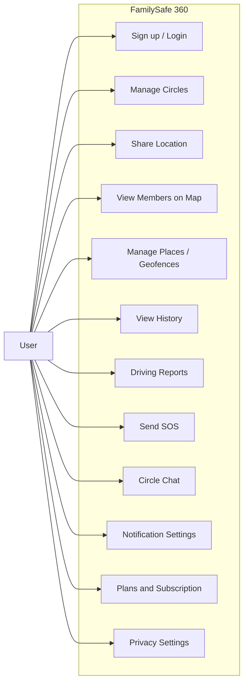
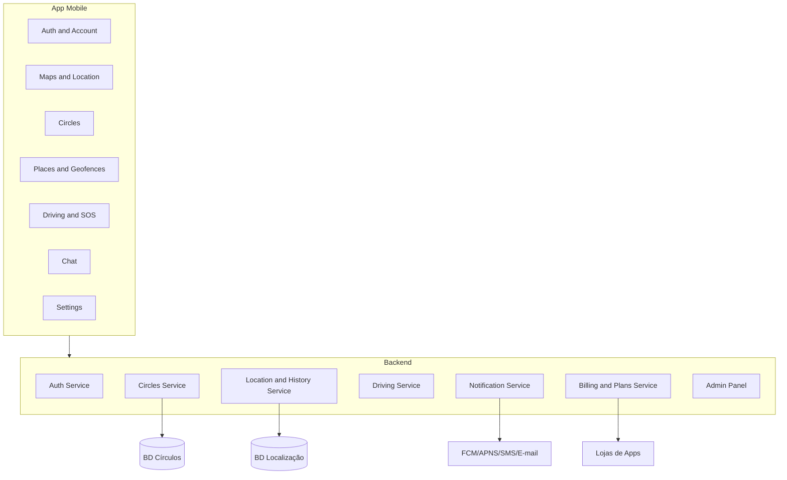
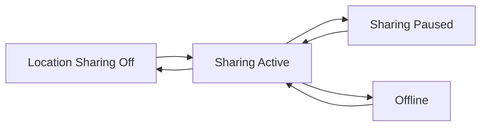
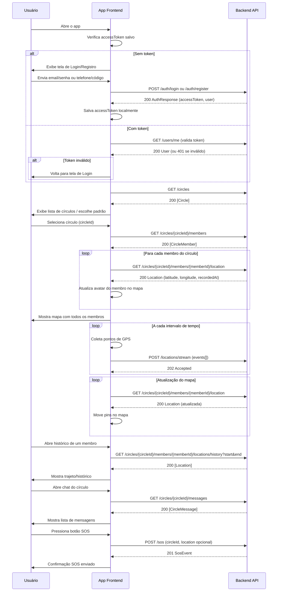
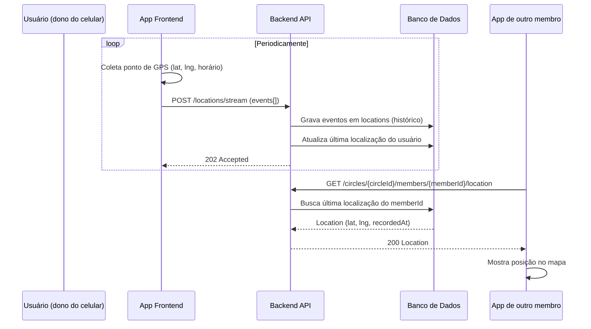
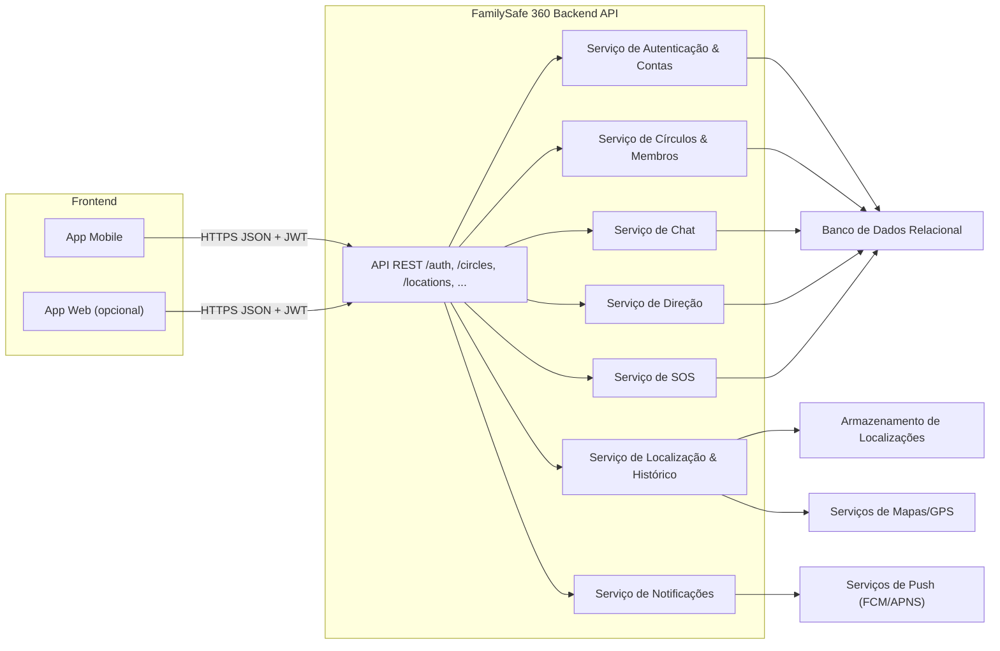

# Diagramas

## 1. Diagrama de Contexto (Nível 0 – Alto Nível)

**Atores externos:**

- Usuário (móvel)
- Serviços de Notificação (FCM/APNS, SMS gateway, e-mail provider)
- Lojas de Aplicativos (Google Play, App Store)
- Serviços de Mapas/GPS (Google Maps, Apple Maps, etc.)

**Sistema central:**

- Sistema FamilySafe 360 (Backend + Banco de Dados + Serviços de Localização)

Representação em Mermaid (pode ser colada em .md compatível):

```mermaid
graph LR
  User[User (Mobile App)] --> Backend[FamilySafe 360 Backend]
  Backend --> DB[Database]
  Backend --> Notif[Notification Services]
  Backend --> Maps[Maps and GPS Services]
  User --> Stores[App Stores]
```

---

## 2. Diagrama de Casos de Uso – Usuário Final (Resumo)

Principais casos de uso:

- UC-01: Cadastrar-se e autenticar-se
- UC-02: Criar e gerenciar círculos
- UC-03: Compartilhar localização em tempo real
- UC-04: Ver membros no mapa
- UC-05: Cadastrar lugares e receber alertas
- UC-06: Consultar histórico de localização
- UC-07: Monitorar e ver relatórios de direção
- UC-08: Acionar e responder a SOS
- UC-09: Enviar mensagens no chat do círculo
- UC-10: Gerenciar notificações e preferências
- UC-11: Gerenciar plano e assinatura
- UC-12: Configurar privacidade

Esboço Mermaid (não é UML puro, mas ajuda na visualização):



---

## 3. Diagrama de Componentes Lógico (Alto Nível)

Componentes internos sugeridos:

- **App Mobile**
  - Módulo de Autenticação
  - Módulo de Mapas & Localização
  - Módulo de Círculos
  - Módulo de Lugares & Geofences
  - Módulo de Direção & SOS
  - Módulo de Chat
  - Módulo de Configurações
- **Backend**
  - Serviço de Autenticação & Contas
  - Serviço de Círculos e Membros
  - Serviço de Localização & Histórico
  - Serviço de Direção & Relatórios
  - Serviço de Notificações
  - Serviço de Billing & Planos
  - Painel Administrativo

Mermaid simplificado:



---

## 4. Diagrama de Estado – Localização de um Usuário (Opcional)

Estados típicos:

- DESATIVADA
- ATIVA_COMPARTILHANDO
- PAUSADA
- OFFLINE (sem rede, com buffer de eventos)

Mermaid:







---

## 5. Diagrama de Componentes – Frontend ↔ Backend

Visão de alto nível de como o(s) frontend(s) se conectam ao backend e como este se organiza internamente:



---

## 6. Diagrama ER Lógico de Referência (Rastreabilidade)

Este diagrama complementa os diagramas de fluxo/arquitetura e reflete as entidades de `database-model.md`.

> Nota: no domínio de direção, a nomenclatura canônica adotada é `drive`.

```mermaid
erDiagram
  USERS ||--o{ AUTH_IDENTITIES : has
  USERS ||--o{ VERIFICATION_TOKENS : verifies
  USERS ||--o{ DEVICES : owns

  USERS ||--o{ CIRCLE_MEMBERS : joins
  CIRCLES ||--o{ CIRCLE_MEMBERS : has
  CIRCLES ||--o{ CIRCLE_INVITES : has
  CIRCLES ||--|| CIRCLE_SETTINGS : configures

  USERS ||--o{ LOCATIONS : generates
  CIRCLES ||--o{ LOCATIONS : context
  USERS ||--o{ LOCATION_SHARING_STATES : controls
  CIRCLES ||--o{ LOCATION_SHARING_STATES : controls

  CIRCLES ||--o{ PLACES : has
  PLACES ||--o{ PLACE_ALERT_POLICIES : defines
  PLACE_ALERT_POLICIES ||--o{ PLACE_ALERT_TARGETS : targets
  PLACES ||--o{ PLACE_EVENTS : produces
  USERS ||--o{ PLACE_EVENTS : triggers

  USERS ||--o{ DRIVES : makes
  DRIVES ||--o{ DRIVE_EVENTS : contains

  USERS ||--o{ SOS_EVENTS : triggers
  CIRCLES ||--o{ SOS_EVENTS : alerts
  INCIDENT_DETECTIONS }o--|| SOS_EVENTS : linked_to

  CIRCLES ||--o{ CIRCLE_MESSAGES : has
  USERS ||--o{ CIRCLE_MESSAGES : sends
  CIRCLE_MESSAGES ||--o{ CIRCLE_MESSAGE_RECEIPTS : receipt

  CIRCLES ||--o{ CHECKINS : receives
  USERS ||--o{ CHECKINS : creates

  USERS ||--o{ NOTIFICATION_PREFERENCES : configures
  USERS ||--o{ NOTIFICATIONS : receives

  PLANS ||--o{ SUBSCRIPTIONS : used_by
  USERS ||--o{ SUBSCRIPTIONS : owns

  ADMIN_USERS ||--o{ USER_FLAGS : creates
  ADMIN_USERS ||--o{ AUDIT_LOGS : writes
```


