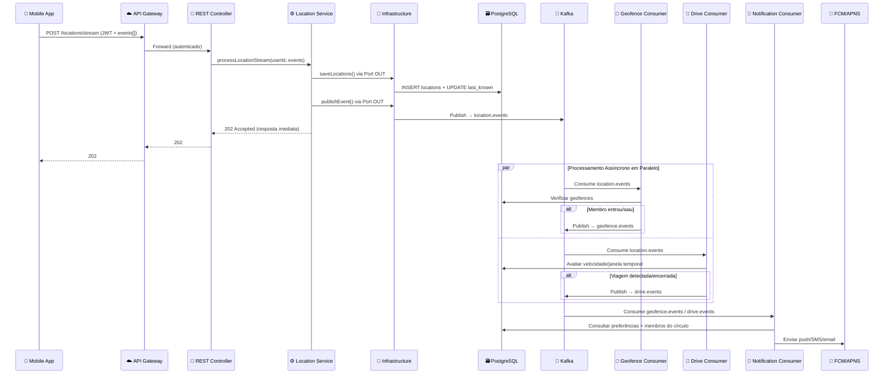
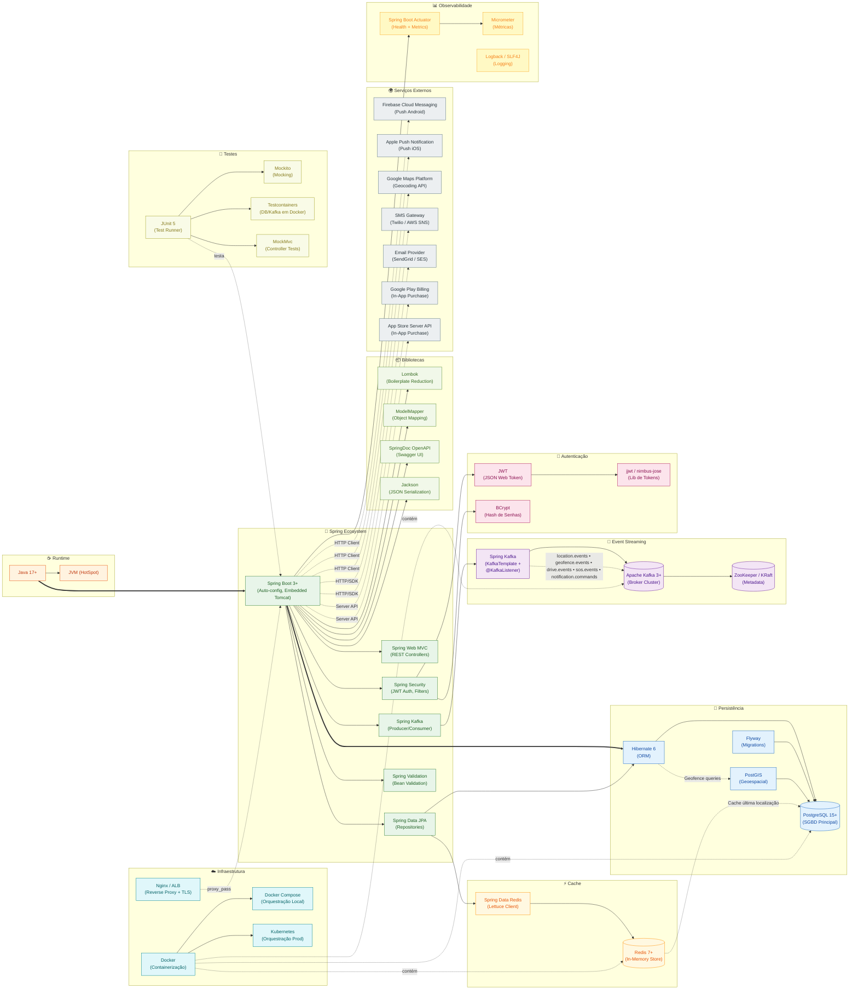

# Locator 360

## 📌 Visão Geral

O **Locator 360** é uma plataforma robusta de monitoramento familiar focada em segurança, rastreamento de localização em tempo real e análise de comportamento de direção. O sistema permite que famílias e grupos de confiança criem "Círculos" para compartilhar sua localização, receber alertas de entrada/saída de lugares (Geofencing) e serem notificados em situações de emergência.

Este projeto backend foi desenhado para ser escalável, seguro e resiliente, utilizando uma arquitetura moderna baseada em domínio.

---

## 🚀 Funcionalidades Principais

### 📍 Localização em Tempo Real

- Rastreamento contínuo de membros do círculo.
- Otimização de bateria através de estratégias inteligentes de coleta.
- Suporte a atualização em background.
- Visualização de status (online, offline, bateria, velocidade).

### 👥 Gestão de Círculos

- Criação de múltiplos grupos (Família, Amigos, Trabalho).
- Convites via código ou link.
- Gestão de permissões (Administrador/Membro).

### 🏠 Lugares & Geofencing

- Cadastro de locais de interesse (Casa, Escola, Trabalho).
- Detecção automática de entrada e saída (Geofence).
- Notificações push personalizáveis para eventos de lugar.

### 🚗 Segurança e Direção (Driving Safety)

- Detecção automática de viagens de carro.
- Análise de comportamento no volante:
  - Excesso de velocidade.
  - Frenagens e acelerações bruscas.
  - Uso de celular ao volante.
- "Safety Score": Pontuação de segurança por viagem e histórica.

### 🆘 SOS e Emergência

- Botão de pânico para envio imediato de alerta.
- Notificação crítica para todos os membros do círculo com localização atualizada.

### 📅 Histórico de Linha do Tempo

- Armazenamento detalhado do histórico de deslocamento.
- Consulta de trajetos por dia e horário.

---

## 🏗 Arquitetura

Este projeto segue a **Arquitetura Vexa**, uma evolução da Arquitetura Hexagonal (Ports & Adapters) otimizada para o ecossistema Spring.

### Princípios da Arquitetura Vexa

1. **Isolamento do Domínio**: O núcleo da aplicação (Core) não depende de detalhes externos (Banco de dados, APIs Web).
2. **Spring-Centric**: Aproveita a injeção de dependência e recursos do Spring sem acoplar a regra de negócio.
3. **Fluxo de Dependência**: `API -> Core <- Infrastructure`.

### Diagrama Completo da Arquitetura

```mermaid
graph TB
  %% ============================
  %% CLIENTS
  %% ============================
  subgraph Clients["🖥️ Clients"]
    direction LR
    MobileAndroid["📱 Android App<br/>(GPS • Push • Background)"]
    MobileiOS["📱 iOS App<br/>(GPS • Push • Background)"]
    WebPanel["🌐 Admin Web Panel<br/>(Backoffice)"]
  end

  %% ============================
  %% API GATEWAY / LOAD BALANCER
  %% ============================
  LB["☁️ Load Balancer / API Gateway<br/>(HTTPS • TLS • Rate Limit)"]

  %% ============================
  %% BACKEND — CAMADA API (Adaptadores de Entrada)
  %% ============================
  subgraph API["📡 Camada API — Adaptadores de Entrada"]
    direction TB
    subgraph REST["REST Controllers"]
      direction LR
      AuthCtrl["Auth Controller<br/>/auth/*"]
      UserCtrl["User Controller<br/>/users/*"]
      CircleCtrl["Circles Controller<br/>/circles/*"]
      LocationCtrl["Location Controller<br/>/locations/*"]
      PlaceCtrl["Places Controller<br/>/circles/.../places/*"]
      DriveCtrl["Driving Controller<br/>/drives/*"]
      SOSCtrl["SOS Controller<br/>/sos/*"]
      ChatCtrl["Chat Controller<br/>/circles/.../messages/*"]
      NotifCtrl["Notifications Controller<br/>/notifications/*"]
      PlanCtrl["Plans Controller<br/>/plans/* • /subscriptions/*"]
      AdminCtrl["Admin Controller<br/>/admin/*"]
    end
    subgraph Consumers["Kafka Consumers (Entrada Assíncrona)"]
      direction LR
      GeoConsumer["🔔 Geofence<br/>Consumer"]
      DriveConsumer["🚗 Drive Detection<br/>Consumer"]
      NotifConsumer["📲 Notification<br/>Dispatch Consumer"]
      SOSConsumer["🆘 SOS Broadcast<br/>Consumer"]
    end
  end

  %% ============================
  %% EVENT BUS — KAFKA
  %% ============================
  subgraph EventBus["📨 Event Bus — Apache Kafka"]
    direction LR
    TopicLoc["📍 location.events<br/>(partitioned by userId)"]
    TopicGeo["🔔 geofence.events<br/>(enter/exit detected)"]
    TopicDrive["🚗 drive.events<br/>(trip start/end/risk)"]
    TopicNotif["📲 notification.commands<br/>(push/sms/email)"]
    TopicSOS["🆘 sos.events<br/>(emergency broadcast)"]
  end

  %% ============================
  %% BACKEND — CAMADA CORE
  %% ============================
  subgraph Core["⚙️ Camada Core — Núcleo da Aplicação"]
    direction TB

    subgraph Ports["Ports (Interfaces)"]
      direction LR
      PortIn["🟢 Ports IN<br/>(Use Cases)"]
      PortOut["🔴 Ports OUT<br/>(Repos, Events & Integrations)"]
    end

    subgraph AppServices["Application Services"]
      direction LR
      AuthSvc["Auth & Account<br/>Service"]
      CircleSvc["Circle & Members<br/>Service"]
      LocationSvc["Location &<br/>History Service"]
      PlaceSvc["Places & Geofence<br/>Service"]
      DriveSvc["Driving & Safety<br/>Service"]
      SOSSvc["SOS & Incident<br/>Service"]
      ChatSvc["Chat & Checkin<br/>Service"]
      NotifSvc["Notification<br/>Service"]
      BillingSvc["Billing & Plans<br/>Service"]
      AdminSvc["Admin & Audit<br/>Service"]
    end

    subgraph Domain["Domain (Entidades & Regras de Negócio)"]
      direction LR
      UserDomain["User<br/>AuthIdentity<br/>Device"]
      CircleDomain["Circle<br/>CircleMember<br/>CircleInvite"]
      LocationDomain["Location<br/>SharingState"]
      PlaceDomain["Place<br/>PlaceAlertPolicy<br/>PlaceEvent"]
      DriveDomain["Drive<br/>DriveEvent<br/>SafetyScore"]
      SOSDomain["SosEvent<br/>IncidentDetection"]
      ChatDomain["CircleMessage<br/>Checkin"]
      NotifDomain["Notification<br/>NotifPreference"]
      BillingDomain["Plan<br/>Subscription"]
      AdminDomain["AdminUser<br/>UserFlag<br/>AuditLog"]
    end
  end

  %% ============================
  %% BACKEND — CAMADA INFRASTRUCTURE (Adaptadores de Saída)
  %% ============================
  subgraph Infra["🔌 Camada Infrastructure — Adaptadores de Saída"]
    direction LR
    JPA["JPA/Hibernate<br/>Repositories"]
    EventPublisher["📨 Kafka Event<br/>Publisher"]
    GeoEngine["Geofence<br/>Engine"]
    DriveDetector["Drive Detection<br/>Engine"]
    NotifAdapter["Push Notification<br/>Adapter"]
    SMSAdapter["SMS/Email<br/>Adapter"]
    MapAdapter["Maps / Geocoding<br/>Adapter"]
    StoreAdapter["Store Billing<br/>Adapter"]
  end

  %% ============================
  %% EXTERNAL SERVICES
  %% ============================
  subgraph External["🌍 Serviços Externos"]
    direction LR
    DB[("🗃️ PostgreSQL<br/>Banco Relacional")]
    Redis[("⚡ Redis/Cache<br/>(Última Localização)")]
    Kafka[("📨 Apache Kafka<br/>Cluster")]
    FCM["📲 FCM / APNS<br/>(Push)"]
    SMSGateway["💬 SMS/Email<br/>Gateway"]
    MapsAPI["🗺️ Google Maps /<br/>Geocoding API"]
    AppStores["🏪 Google Play /<br/>App Store"]
  end

  %% ============================
  %% CONNECTIONS — Clients to Gateway
  %% ============================
  MobileAndroid -->|"HTTPS + JWT"| LB
  MobileiOS -->|"HTTPS + JWT"| LB
  WebPanel -->|"HTTPS + JWT"| LB

  %% Gateway to API Layer (REST)
  LB --> REST

  %% REST Controllers to Core (via Ports IN)
  AuthCtrl --> PortIn
  UserCtrl --> PortIn
  CircleCtrl --> PortIn
  LocationCtrl --> PortIn
  PlaceCtrl --> PortIn
  DriveCtrl --> PortIn
  SOSCtrl --> PortIn
  ChatCtrl --> PortIn
  NotifCtrl --> PortIn
  PlanCtrl --> PortIn
  AdminCtrl --> PortIn

  %% Kafka Consumers to Core (via Ports IN)
  GeoConsumer --> PortIn
  DriveConsumer --> PortIn
  NotifConsumer --> PortIn
  SOSConsumer --> PortIn

  %% Kafka Topics feed Consumers
  TopicLoc -.->|"consume"| GeoConsumer
  TopicLoc -.->|"consume"| DriveConsumer
  TopicGeo -.->|"consume"| NotifConsumer
  TopicDrive -.->|"consume"| NotifConsumer
  TopicSOS -.->|"consume"| SOSConsumer
  TopicNotif -.->|"consume"| NotifConsumer

  %% Ports IN to App Services
  PortIn --> AuthSvc
  PortIn --> CircleSvc
  PortIn --> LocationSvc
  PortIn --> PlaceSvc
  PortIn --> DriveSvc
  PortIn --> SOSSvc
  PortIn --> ChatSvc
  PortIn --> NotifSvc
  PortIn --> BillingSvc
  PortIn --> AdminSvc

  %% App Services use Domain
  AuthSvc --> UserDomain
  CircleSvc --> CircleDomain
  LocationSvc --> LocationDomain
  PlaceSvc --> PlaceDomain
  DriveSvc --> DriveDomain
  SOSSvc --> SOSDomain
  ChatSvc --> ChatDomain
  NotifSvc --> NotifDomain
  BillingSvc --> BillingDomain
  AdminSvc --> AdminDomain

  %% App Services to Ports OUT
  AuthSvc --> PortOut
  CircleSvc --> PortOut
  LocationSvc --> PortOut
  PlaceSvc --> PortOut
  DriveSvc --> PortOut
  SOSSvc --> PortOut
  ChatSvc --> PortOut
  NotifSvc --> PortOut
  BillingSvc --> PortOut
  AdminSvc --> PortOut

  %% Ports OUT to Infrastructure
  PortOut --> JPA
  PortOut --> EventPublisher
  PortOut --> GeoEngine
  PortOut --> DriveDetector
  PortOut --> NotifAdapter
  PortOut --> SMSAdapter
  PortOut --> MapAdapter
  PortOut --> StoreAdapter

  %% Infrastructure to External
  JPA --> DB
  JPA --> Redis
  EventPublisher --> Kafka
  Kafka --> EventBus
  GeoEngine --> DB
  DriveDetector --> DB
  NotifAdapter --> FCM
  SMSAdapter --> SMSGateway
  MapAdapter --> MapsAPI
  StoreAdapter --> AppStores

  %% ============================
  %% STYLING
  %% ============================
  classDef clientStyle fill:#E3F2FD,stroke:#1565C0,color:#0D47A1
  classDef apiStyle fill:#FFF3E0,stroke:#E65100,color:#BF360C
  classDef coreStyle fill:#E8F5E9,stroke:#2E7D32,color:#1B5E20
  classDef infraStyle fill:#F3E5F5,stroke:#6A1B9A,color:#4A148C
  classDef extStyle fill:#FCE4EC,stroke:#AD1457,color:#880E4F
  classDef lbStyle fill:#FFFDE7,stroke:#F9A825,color:#F57F17
  classDef kafkaStyle fill:#FFF8E1,stroke:#FF8F00,color:#E65100

  class MobileAndroid,MobileiOS,WebPanel clientStyle
  class AuthCtrl,UserCtrl,CircleCtrl,LocationCtrl,PlaceCtrl,DriveCtrl,SOSCtrl,ChatCtrl,NotifCtrl,PlanCtrl,AdminCtrl apiStyle
  class GeoConsumer,DriveConsumer,NotifConsumer,SOSConsumer apiStyle
  class PortIn,PortOut,AuthSvc,CircleSvc,LocationSvc,PlaceSvc,DriveSvc,SOSSvc,ChatSvc,NotifSvc,BillingSvc,AdminSvc,UserDomain,CircleDomain,LocationDomain,PlaceDomain,DriveDomain,SOSDomain,ChatDomain,NotifDomain,BillingDomain,AdminDomain coreStyle
  class JPA,EventPublisher,GeoEngine,DriveDetector,NotifAdapter,SMSAdapter,MapAdapter,StoreAdapter infraStyle
  class DB,Redis,Kafka,FCM,SMSGateway,MapsAPI,AppStores extStyle
  class LB lbStyle
  class TopicLoc,TopicGeo,TopicDrive,TopicNotif,TopicSOS kafkaStyle
```



### Legenda das Camadas

| Cor | Camada | Responsabilidade |
|-----|--------|-----------------|
| 🔵 Azul | **Clients** | Apps mobile (Android/iOS) e painel web administrativo |
| 🟡 Amarelo | **API Gateway** | Load balancer, terminação TLS, rate limiting |
| 🟠 Laranja | **API (Adaptadores de Entrada)** | Controllers REST + Kafka Consumers que recebem requisições/eventos |
| 🟡 Amarelo-claro | **Event Bus (Kafka)** | Tópicos de eventos que desacoplam produtores e consumidores |
| 🟢 Verde | **Core (Núcleo)** | Ports, Application Services e Domain — regras de negócio puras |
| 🟣 Roxo | **Infrastructure (Adaptadores de Saída)** | Persistência, publicação de eventos e integrações externas |
| 🔴 Rosa | **Serviços Externos** | PostgreSQL, Redis, Kafka, FCM/APNS, APIs de mapas, lojas de apps |

### Descrição dos Componentes

#### Camada API — REST Controllers (11)

| Controller | Endpoints | Responsabilidade |
|-----------|-----------|------------------|
| Auth | `/auth/*` | Registro, login, verificação, tokens JWT |
| User | `/users/*` | CRUD de perfil do usuário autenticado |
| Circles | `/circles/*` | Criação, gestão de membros, convites, configurações |
| Location | `/locations/*` | Ingestão em lote (stream) de eventos GPS → publica no Kafka |
| Places | `/circles/.../places/*` | CRUD de lugares, políticas de alerta, geofencing |
| Driving | `/drives/*` | Consulta de viagens, eventos de direção, safety score |
| SOS | `/sos/*` | Acionamento e resolução de emergências → publica no Kafka |
| Chat | `/circles/.../messages/*` | Chat de grupo e check-ins manuais |
| Notifications | `/notifications/*` | Preferências e histórico de notificações |
| Plans | `/plans/*`, `/subscriptions/*` | Planos disponíveis e gestão de assinaturas |
| Admin | `/admin/*` | Backoffice: busca de usuários, flags, auditoria |

#### Camada API — Kafka Consumers (4)

| Consumer | Tópico(s) Consumido(s) | Responsabilidade |
|----------|----------------------|------------------|
| Geofence Consumer | `location.events` | Avalia cada localização contra geofences → gera `geofence.events` |
| Drive Detection Consumer | `location.events` | Algoritmo stateful de detecção de viagens → gera `drive.events` |
| Notification Dispatch Consumer | `geofence.events`, `drive.events`, `notification.commands` | Despacha push/SMS/email com base nos eventos recebidos |
| SOS Broadcast Consumer | `sos.events` | Distribui alertas de emergência para todos os membros do círculo |

#### Event Bus — Tópicos Kafka (5)

| Tópico | Particionamento | Produtor | Consumidor(es) |
|--------|----------------|----------|----------------|
| `location.events` | `userId` | Location Service (via Publisher) | Geofence Consumer, Drive Detection Consumer |
| `geofence.events` | `circleId` | Geofence Consumer | Notification Dispatch Consumer |
| `drive.events` | `userId` | Drive Detection Consumer | Notification Dispatch Consumer |
| `notification.commands` | `userId` | Qualquer Service que precise notificar | Notification Dispatch Consumer |
| `sos.events` | `circleId` | SOS Service (via Publisher) | SOS Broadcast Consumer |

#### Camada Core (10 Domínios de Negócio)

| Domínio | Entidades Principais | Regras-Chave |
|---------|---------------------|-------------|
| **Auth & Account** | User, AuthIdentity, Device, VerificationToken | Multi-provider login, verificação, sessões por dispositivo |
| **Circles & Members** | Circle, CircleMember, CircleInvite, CircleSettings | Papéis ADMIN/MEMBER, convites com expiração, transferência de admin |
| **Location & History** | Location, LocationSharingState | Ingestão em lote, última posição, pausa de compartilhamento |
| **Places & Geofence** | Place, PlaceAlertPolicy, PlaceAlertTarget, PlaceEvent | Detecção enter/exit, políticas por dia/horário, destinatários custom |
| **Driving & Safety** | Drive, DriveEvent, SafetyScore | Detecção automática de viagens (CAR), eventos de risco, score 0-100 |
| **SOS & Incidents** | SosEvent, IncidentDetection | SOS manual/automático, detecção de colisão, workflow OPEN→RESOLVED |
| **Chat & Checkin** | CircleMessage, CircleMessageReceipt, Checkin | Chat por círculo, recibos de leitura, check-in com localização |
| **Notifications** | Notification, NotificationPreference | Push/SMS/email, preferências por tipo e por círculo, mute temporário |
| **Billing & Plans** | Plan, Subscription | Planos FREE/PREMIUM, integração com Google Play e App Store |
| **Admin & Audit** | AdminUser, UserFlag, AuditLog | Papéis SUPPORT/ADMIN/SUPER_ADMIN, flags de abuso, trilha de auditoria |

#### Camada Infrastructure (8 Adaptadores de Saída)

| Adaptador | Serviço Externo | Função |
|-----------|----------------|--------|
| **JPA/Hibernate Repositories** | PostgreSQL + Redis | Persistência relacional e cache de última localização |
| **Kafka Event Publisher** | Apache Kafka | Publicação de eventos de domínio nos tópicos (location, geofence, drive, sos, notification) |
| **Geofence Engine** | PostgreSQL (PostGIS) | Cálculo de entrada/saída em cercas virtuais |
| **Drive Detection Engine** | PostgreSQL | Algoritmo de detecção de viagens baseado em velocidade/tempo |
| **Push Notification Adapter** | FCM / APNS | Envio de notificações push para Android e iOS |
| **SMS/Email Adapter** | SMS Gateway / Email Provider | Verificação de conta, alertas SOS por SMS/email |
| **Maps/Geocoding Adapter** | Google Maps API | Geocodificação reversa (coordenadas → endereço) |
| **Store Billing Adapter** | Google Play / App Store | Validação de compras in-app e status de assinatura |

### Estrutura de Pastas do Backend

```text
/src/main/java/com/locator360
├── api/                              # Adaptadores de Entrada
│   ├── rest/                         # Controllers REST (síncrono)
│   │   ├── auth/
│   │   ├── user/
│   │   ├── circle/
│   │   ├── location/
│   │   ├── place/
│   │   ├── drive/
│   │   ├── sos/
│   │   ├── chat/
│   │   ├── notification/
│   │   ├── plan/
│   │   ├── admin/
│   │   └── config/                   # Configurações REST (CORS, interceptors, etc.)
│   └── kafka/                        # Kafka Consumers (assíncrono)
│       ├── geofence/                 # Consome location.events
│       ├── drive/                    # Consome location.events
│       ├── notification/             # Consome geofence/drive/notif events
│       └── sos/                      # Consome sos.events
├── core/                             # Núcleo da Aplicação
│   ├── domain/                       # Entidades, Value Objects, Enums
│   │   ├── user/
│   │   ├── circle/
│   │   ├── location/
│   │   ├── place/
│   │   ├── drive/
│   │   ├── sos/
│   │   ├── chat/
│   │   ├── notification/
│   │   ├── plan/
│   │   ├── admin/
│   │   ├── vo/                       # Value Objects compartilhados do domínio
│   │   └── service/                  # Domain Services (regras de negócio entre entidades)
│   ├── application/                  # Casos de Uso (Services)
│   │   ├── service/                  # Application Services (implementam os Ports IN)
│   │   │   ├── auth/
│   │   │   ├── circle/
│   │   │   ├── location/
│   │   │   ├── place/
│   │   │   ├── drive/
│   │   │   ├── sos/
│   │   │   ├── chat/
│   │   │   ├── notification/
│   │   │   ├── plan/
│   │   │   └── admin/
│   │   └── mapper/                   # (Opcional) Configurações complexas de ModelMapper
│   └── port/                         # Interfaces
│       ├── in/                       # Ports IN (Use Cases interfaces)
│       │   ├── auth/
│       │   ├── circle/
│       │   ├── location/
│       │   ├── place/
│       │   ├── drive/
│       │   ├── sos/
│       │   ├── chat/
│       │   ├── notification/
│       │   ├── plan/
│       │   ├── admin/
│       │   └── dto/                  # DTOs dos Ports IN
│       │       ├── input/            # DTOs de entrada
│       │       └── output/           # DTOs de saída
│       └── out/                      # Ports OUT (Repository/Integration interfaces)
└── infrastructure/                   # Adaptadores de Saída
    ├── persistence/                  # Persistência (JPA/Spring Data)
    │   └── postgresql/               # Implementação PostgreSQL
    │       ├── entity/               # JPA Entities
    │       │   ├── user/
    │       │   ├── circle/
    │       │   ├── location/
    │       │   ├── place/
    │       │   ├── drive/
    │       │   ├── sos/
    │       │   ├── chat/
    │       │   ├── notification/
    │       │   ├── plan/
    │       │   └── admin/
    │       ├── repository/           # Implementação dos Ports OUT de persistência
    │       │   ├── user/
    │       │   ├── circle/
    │       │   ├── location/
    │       │   ├── place/
    │       │   ├── drive/
    │       │   ├── sos/
    │       │   ├── chat/
    │       │   ├── notification/
    │       │   ├── plan/
    │       │   └── admin/
    │       ├── mapper/               # (Opcional) Configurações complexas Entity ↔ Domain
    │       └── config/               # Configurações de banco de dados
    ├── rest/                         # Clientes REST para APIs externas
    │   ├── notification/             # FCM/APNS adapter
    │   ├── sms/                      # SMS gateway adapter
    │   ├── maps/                     # Geocoding adapter
    │   ├── billing/                  # Store billing adapter
    │   ├── mapper/                   # (Opcional) Configurações complexas de mapeamento
    │   ├── config/                   # Configurações de RestTemplate/WebClient
    │   └── properties/              # Properties dos clientes externos
    └── event/                        # Event Publishers
        └── kafka/                    # Implementação Kafka
            ├── publisher/            # Implementação de publicação nos tópicos
            ├── mapper/               # (Opcional) Configurações complexas de mapeamento
            ├── config/               # Configurações Kafka (topics, serializers, etc.)
            └── properties/           # Properties de eventos
```

### Fluxo de Dados Principal (Event-Driven)



**Vantagens deste fluxo event-driven:**

1. **Resposta instantânea** — O `POST /locations/stream` retorna `202` em milissegundos, sem esperar geofence ou drive detection.
2. **Desacoplamento** — Geofence, Drive e Notification são consumers independentes. Podem escalar separadamente.
3. **Resiliência** — Se o Notification Consumer cair, os eventos ficam no Kafka até serem processados (retention).
4. **Paralelismo** — Geofence e Drive detection consomem o mesmo tópico em paralelo, sem interferir um no outro.
5. **Replay** — Em caso de bug, é possível reprocessar eventos do Kafka sem impactar o fluxo do usuário.

---

## 🛠 Tech Stack

- **Linguagem**: Java 17+
- **Framework**: Spring Boot 3+
- **Banco de Dados**: PostgreSQL + PostGIS (dados geoespaciais)
- **Cache**: Redis (última localização conhecida, sessões)
- **Event Streaming**: Apache Kafka (processamento assíncrono de localização, geofences, drives, notificações)
- **Migração de Dados**: Flyway / Liquibase
- **Autenticação**: JWT (JSON Web Token)
- **Documentação de API**: OpenAPI 3.0 (Swagger)
- **Mapeamento**: ModelMapper
- **Utilitários**: Lombok

### Diagrama da Tech Stack e Relacionamentos



#### Legenda da Tech Stack

| Cor | Grupo | Tecnologias |
|-----|-------|-------------|
| 🟠 Laranja | **Runtime** | Java 17+, JVM HotSpot |
| 🟢 Verde | **Spring Ecosystem** | Spring Boot 3, Web MVC, Security, Data JPA, Kafka, Validation |
| 🔵 Azul | **Persistência** | PostgreSQL 15+, PostGIS, Hibernate 6, Flyway |
| 🟡 Amarelo | **Cache** | Redis 7+, Spring Data Redis (Lettuce) |
| 🟣 Roxo | **Event Streaming** | Apache Kafka 3+, Spring Kafka, ZooKeeper/KRaft |
| 🔴 Rosa | **Autenticação** | JWT, jjwt/nimbus-jose, BCrypt |
| 🟢 Verde-claro | **Bibliotecas** | Lombok, ModelMapper, SpringDoc OpenAPI, Jackson |
| ⚪ Cinza | **Serviços Externos** | FCM, APNS, Google Maps, SMS Gateway, Email Provider, Play/App Store |
| 🔵 Ciano | **Infraestrutura** | Docker, Docker Compose, Kubernetes, Nginx/ALB |
| 🟡 Amarelo-claro | **Observabilidade** | Spring Actuator, Micrometer, Logback/SLF4J |
| 🟢 Lima | **Testes** | JUnit 5, Mockito, Testcontainers, MockMvc |

---

## 📚 Documentação do Projeto

A documentação detalhada encontra-se na pasta `Docs/`:

- **[Especificação Funcional](Docs/especificacao-funcional.md)**: Detalha todos os requisitos de negócio, personas e módulos (Conta, Círculos, Lugares, etc.).
- **[Modelo de Dados](Docs/database-model.md)**: Estrutura completa das tabelas e relacionamentos (`users`, `circles`, `locations`, `drives`, etc.).
- **[Estratégia de Detecção](Docs/detection-strategy.md)**: Algoritmos para detectar viagens de carro e eventos de risco (frenagem, velocidade).
- **[Estratégia de Rastreamento](Docs/location-tracking-strategy.md)**: Como o app coleta e envia dados de GPS para economizar bateria e garantir precisão.
- **[API OpenAPI](Docs/openapi.yaml)**: Especificação técnica dos endpoints.

### Fluxo de Autenticação

O sistema utiliza **JWT**. O fluxo consiste em:

1. `POST /auth/login` retorna um `accessToken`.
2. O client deve enviar o header `Authorization: Bearer <token>` em requisições protegidas.

---

## 🚦 Como Rodar

### Pré-requisitos

- JDK 17+
- Docker (opcional, para banco de dados)
- Maven

### Passos

1. **Clonar o repositório:**

    ```bash
    git clone https://github.com/seu-usuario/locator360.git
    ```

2. **Configurar Banco de Dados:**
    Ajuste as configurações no `application.yml` ou suba o container via docker-compose (se disponível).
3. **Compilar e Rodar:**

    ```bash
    ./mvnw spring-boot:run
    ```

4. **Acessar Swagger UI:**
    Acesse `http://localhost:8080/swagger-ui.html` para testar os endpoints.

---

## 🧪 Estratégia de Testes

Seguindo a arquitetura, priorizamos testes unitários e de integração:

- **Unitários**: Focados no `Core` (Domain e Application Services). Devem validar as regras de negócio isoladamente.
- **Integração**: Testes de Controllers (`API`) ou Repositórios (`Infrastructure`) para garantir o funcionamento ponta a ponta.

---

## 🤝 Contribuição

1. Siga as convenções de código definidas.
2. Respeite a arquitetura Vexa (não injete Repositories diretamente em Controllers, use Services/Ports).
3. Crie Pull Requests pequenos e focados.

---

**Locator 360** — Segurança e conexão para quem você ama.
